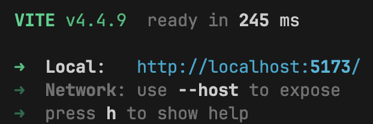

# Фронтенд проекта предсказательной модели (Хакатон Лента)

### [Ссылка](https://tsverkunov.github.io/hackathon-lenta/) на проект

## Системные требования для локального запуска

* Node JS - v.20.0.0 или новее - [скачать](https://nodejs.org/ru) (скорее всего подойдет и более ранняя версия)

## Локальный запуск проекта

1. Клонировать репозиторий `git clone https://github.com/tsverkunov/hackathon-lenta.git`
2. Выполнить команду `npm i` в терминале для установки всех зависимостей
3. Запустить сервер командой `npm start` или `npm run dev`
4. Перейти по ссылке `Local` в терминале - в браузере откроется страница проекта

   

## Стек технологий

1. [*Vite*](https://vitejs.dev "Vite")
2. [*React*](https://react.dev "React")
3. [*Redux Toolkit*](https://redux-toolkit.js.org "Redux Toolkit")
4. *Javascript*
5. *Css modules*
6. [*Ant Design*](https://ant.design "Ant Design")
7. [*Docker*](https://www.docker.com "Docker")

## API

Для взаимодействия с API необходимо поднять backend часть приложения, которую можно найти по 
[ссылке](https://github.com/kubanez-create/Lenta_TS_backend) с подробной инструкцией по установке.

## Docker

Локальный запуск проекта с помощью Docker.
1. Установите [*Docker*](https://www.docker.com/get-started/ "Docker get started") на свою машину.
2. Скачайте образ проекта. Для этого запустите в терминале команду:

``` sh 
docker pull itsverkunov/front_lenta:v1.0
```
3. Запустите контейнер:
```sh
docker run -p 3000:3000 --rm itsverkunov/front_lenta:v1.0
```
4. Далее по этому адресу будет доступно приложение [*http://localhost:3000*](http://localhost:3000)
## Авторы

[Цверкунов Иван](https://github.com/tsverkunov) 🤜🤛 [Боровов Даниил](https://github.com/Inc0re)
